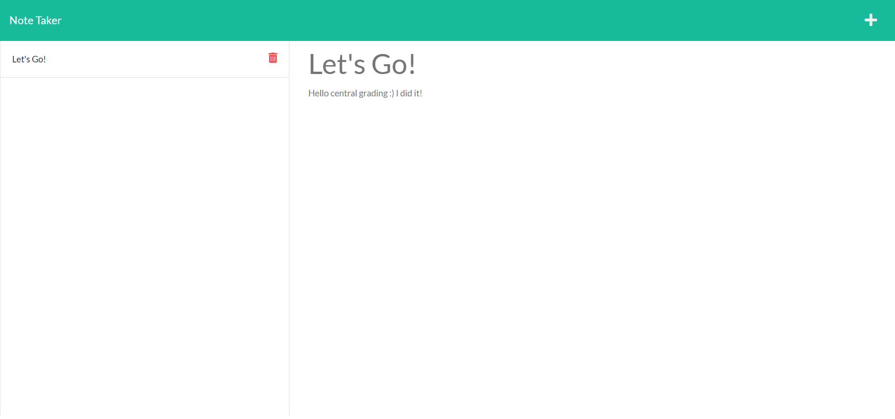

# NoteTaker

## Table of Contents

- [Decription](#decription)

- [Deployment](#deployment)

- [Usage](#usage)

- [Credits](#credits)

- [Contact](#contact)

## Decription

This is a note taker! Users can add notes witha title and details, and also delete them!

## Deployment

- [Deployed Application](https://note-takerg.herokuapp.com/)

- 

## Usage

When entering the site, users can click on the get started button, and then they can write and save notes, also click the red trash can to delete them.

## Credits

[Starter code](https://github.com/coding-boot-camp/miniature-eureka)

## Contact

For questions, contact me at:

- [Github](www.github.com/GarrettA01)

- [Email](gman.anderson2001@gmail.com)
